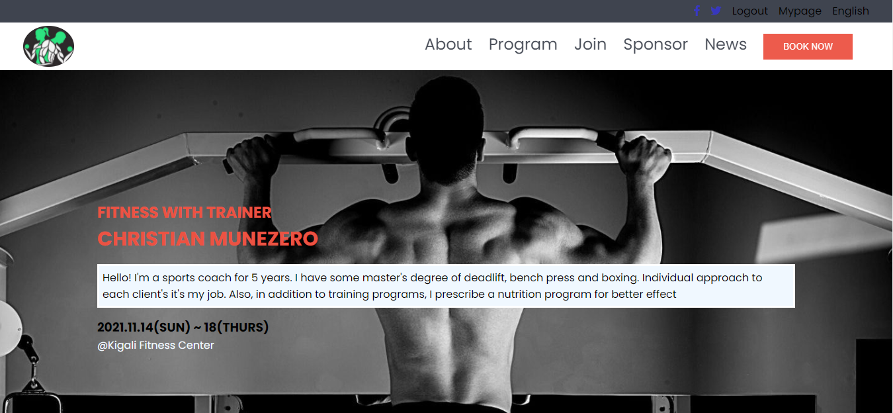

# HTML/CSS & JavaScript Capstone Project - Kigali Fitness Center



## Built With

- HTML, CSS & JS
- Hint, Stylelint, Eslint

## Live Demo

[Kigali Fitness Center](https://kaitcham.github.io/Personal-trainer/)

## Getting Started

To get a local copy up and running follow these simple example steps.

### Prerequisites

```
node and npm
```

### Setup

```
- clone the repo
- cd into it
- npm install
```

### Install

```
open the html file
```

### Usage

```
navigate through the pages to see different contents
```

### Deployment

```
set up on github pages
```

## Authors

👤 **Kait Cham**

- GitHub: [@kaitcham](https://github.com/kaitcham)
- Twitter: [@kaitcham](https://twitter.com/kaitcham)
- LinkedIn: [kaitcham](https://linkedin.com/in/kaitcham)

## 🤝 Contributing

Contributions, issues, and feature requests are welcome!

Feel free to check the [issues page](https://github.com/kaitcham/Personal-trainer/issues).

## Show your support

Give a ⭐️ if you like this project!

## Acknowledgments

- Hats off to the UI/UX designer Cindy Shin [@adagio07](https://www.behance.net/adagio07)

## 📝 License

This project is [MIT](./MIT.md) licensed.
